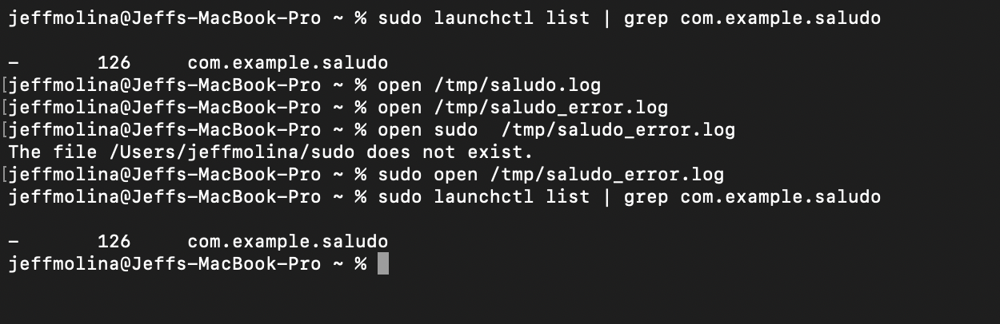

# Actividad 3 - 201945242
## Ejecutar un script al inicio del sistema en  usando launchd 


Este repositorio contiene un script y las instrucciones necesarias para ejecutar un script al inicio del sistema en macOS utilizando `launchd`.

### Contenido del Repositorio

- `saludo.sh`: Este script imprime un saludo y la fecha actual infinitamente con una pausa de un segundo.
- `com.example.saludo.plist`: Archivo de configuración plist para `launchd` que ejecutará el script al inicio del sistema.
- `README.md`: Este archivo.

### Instrucciones

1. Clona este repositorio o descarga los archivos `saludo.sh` y `com.example.saludo.plist` en tu máquina local.

2. Abre un terminal y navega hasta la ubicación donde descargaste los archivos.

3. Dale permisos de ejecución al script:

    ```bash
    chmod +x saludo.sh
    ```

4. Editar el archivo `com.example.saludo.plist` para proporcionar la ruta correcta al script `saludo.sh`. Abre el archivo con un editor de texto y modifica la línea `<string>/ruta/del/archivo/saludo.sh</string>` con la ubicación real del archivo `saludo.sh` en tu sistema.

5. Copia el archivo plist al directorio `~/Library/LaunchAgents/`:

    ```bash
    cp com.example.saludo.plist ~/Library/LaunchAgents/
    ```

6. Carga el archivo plist en `launchd`:

    ```bash
    launchctl load ~/Library/LaunchAgents/com.example.saludo.plist
    ```

Ahora, cada vez que reinicies tu sistema, el script `saludo.sh` se ejecutará automáticamente al inicio, imprimiendo un saludo y la fecha actual infinitamente con una pausa de un segundo.

**Nota:** Asegúrate de reemplazar `/ruta/del/archivo/saludo.sh` con la ubicación real de tu script en el paso 4.



