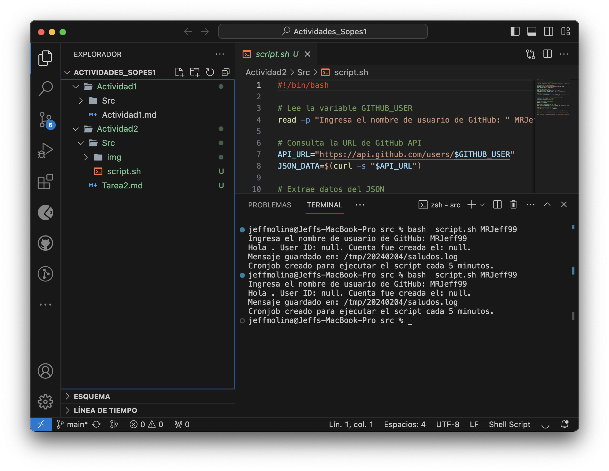
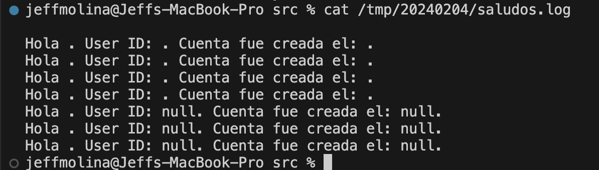

# Actividad 2
Creamos nuestro archivo .SH
`script.sh`

```
#!/bin/bash

# Lee la variable GITHUB_USER
read -p "Ingresa el nombre de usuario de GitHub: " MRJeff99

# Consulta la URL de GitHub API
API_URL="https://api.github.com/users/$GITHUB_USER"
JSON_DATA=$(curl -s "$API_URL")

# Extrae datos del JSON
USER_ID=$(echo "$JSON_DATA" | jq -r '.id')
CREATED_AT=$(echo "$JSON_DATA" | jq -r '.created_at')

# Imprime el mensaje
echo "Hola $GITHUB_USER. User ID: $USER_ID. Cuenta fue creada el: $CREATED_AT."

# Crea el log file en /tmp/<fecha>/saludos.log
LOG_DIR="/tmp/$(date +'%Y%m%d')"
LOG_FILE="$LOG_DIR/saludos.log"

# Crea directorio si no existe
mkdir -p "$LOG_DIR"

# Escribe el mensaje en el log file
echo "Hola $GITHUB_USER. User ID: $USER_ID. Cuenta fue creada el: $CREATED_AT." >> "$LOG_FILE"

# Muestra la ubicación del log file
echo "Mensaje guardado en: $LOG_FILE"

# Crea un cronjob para ejecutar el script cada 5 minutos
(crontab -l 2>/dev/null; echo "*/5 * * * * /ruta/al/script.sh") | crontab -

echo "Cronjob creado para ejecutar el script cada 5 minutos."

```


Instalamos `jq` para la lectura de .Json

`/bin/bash -c "$(curl -fsSL https://raw.githubusercontent.com/Homebrew/install/HEAD/install.sh)"
`

`brew install jq`

Darle permisos al archivo

`chmod +x script.sh`

Guardar y Cerrar archivo.

## Cronjob

- Ahora, para crear un cronjob que se ejecute cada 5 minutos, abre el crontab con:
bash

```
crontab -e
```

Añade la siguiente línea al archivo crontab:

```
*/5 * * * * /Users/jeffmolina/Documents/GitHub/Actividades_Sopes1/Actividad2/Src/script.sh
```


## Script Ejecutado



